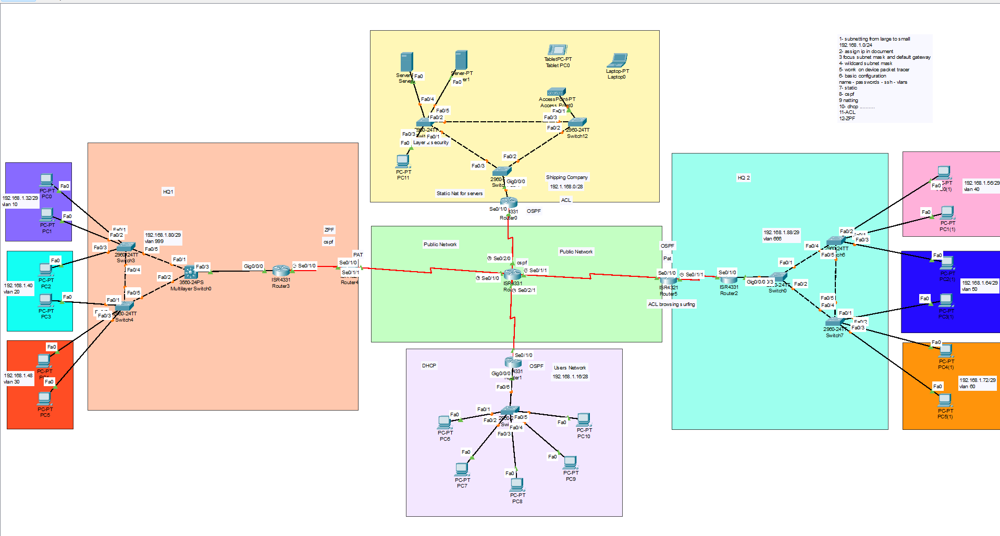

# Enterprise Network Design – Cisco Packet Tracer Project

This repository contains a **Cisco Packet Tracer project (.pkt)** that simulates an enterprise-level network with **multiple HQs, branch networks, servers, VLANs, dynamic routing, and security policies**.  

The design showcases **end-to-end networking skills** across subnetting, routing, switching, NAT, ACLs, DHCP, and firewalling.

---

## 📌 Project Overview
The project demonstrates the design and configuration of a multi-site enterprise network with the following components:

- **HQ1 & HQ2** networks with multiple VLANs
- **Shipping Company Servers** with Static NAT for public access
- **User Network** using DHCP for IP assignment
- **Public Network backbone** interconnecting HQs and external sites
- **Security features** including ACLs and Zone-Based Firewall (ZPF)

---

## 🛠️ Networking Features Implemented
1. **Subnetting** – from `192.168.1.0/24` into multiple subnets  
2. **IP Addressing** – IP assignments with proper subnet masks and default gateways  
3. **VLANs** – segmentation for departments (VLAN 10, 20, 30, 40, 60, 99)  
4. **Basic Device Configuration** – hostnames, passwords, SSH, VLANs on switches  
5. **Static Routing** – used for specific point-to-point connections  
6. **OSPF (Open Shortest Path First)** – dynamic routing protocol across routers  
7. **NAT/PAT** – translating internal private IPs to public IPs  
8. **DHCP** – dynamic IP assignment for end-user devices  
9. **Access Control Lists (ACLs)** – traffic filtering and access restrictions  
10. **Zone-Based Policy Firewall (ZPF)** – for advanced perimeter security  
11. **Server Configurations** – accessible using **Static NAT**  
12. **End Devices** – PCs, laptops, and tablets connected to VLANs and DHCP  

---

## 📸 Network Topology
The complete topology was designed in Cisco Packet Tracer:

---

## ▶️ How to Use
1. Download and install [Cisco Packet Tracer](https://www.netacad.com/courses/packet-tracer).  
2. Clone this repository or download the `.pkt` file.  
3. Open the `.pkt` file in Packet Tracer to explore the full topology and configurations.  

---

## 🎓 Skills Demonstrated
- Subnetting & IP Addressing  
- VLAN Configuration & Inter-VLAN Routing  
- Static & Dynamic Routing with OSPF  
- NAT & PAT configuration  
- DHCP server setup for user networks  
- Traffic filtering using ACLs  
- Perimeter security with Zone-Based Firewall (ZPF)  
- Server access with Static NAT  

---
